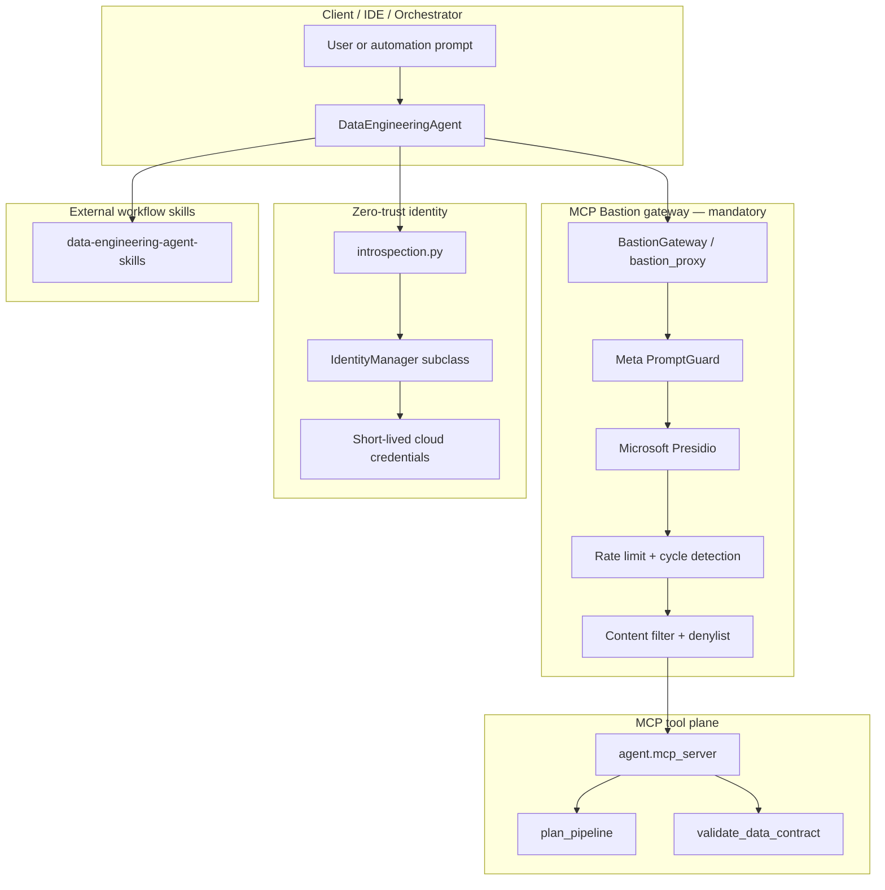

# Architecture — zero-trust data engineering agent

How user requests, MCP tool calls, cloud identity, and workflow skills flow through **cloud-security-agent-skills**.

## End-to-end data flow



## Components

| Component | Path | Role |
|-----------|------|------|
| Orchestrator | `agent/orchestrator.py` | Cloud detect, identity init, skill context, posture checks |
| Bastion gateway | `agent/bastion_gateway.py` | Load `bastion.yaml`; produce MCP launch argv |
| Stdio proxy | `agent/bastion_proxy.py` | Process hop — agent never connects raw to MCP |
| Tool wrapper | `agent/bastion_wrapper.py` | Inbound injection/denylist + outbound PII redaction |
| MCP server | `agent/mcp_server/` | Reference tools for plan / validate / echo |
| Identity ABC | `security/base.py` | `IdentityManager` + `CloudCredentials` lifecycle |
| Introspection | `security/introspection.py` | `OCI_RESOURCE_PRINCIPAL_VERSION`, `TRUSTED_PROFILE_NAME`, etc. |
| Cloud managers | `security/*.py` | Provider-specific ephemeral credential chains |
| Skills loader | `agent/skills_loader.py` | Progressive load from `SKILLS_PATH` |
| Policy | `bastion.yaml` | PromptGuard, Presidio, rate limits, RBAC, cost caps |

## Threat model (summary)

| Threat | Mitigation |
|--------|------------|
| Static API keys in code or config | `.cursorrules` + AIV design rules; identity via provider chains only |
| Direct MCP bypass (no Bastion) | `DataEngineeringAgent.mcp_launch_command()` always wraps proxy |
| Prompt injection via tool args | Meta PromptGuard + `content_filter.denylist_patterns` |
| PII reaching LLM context | Presidio redaction on outbound tool results |
| Runaway agent loops / bill overrun | Token bucket, `max_iterations`, cycle detection in `bastion.yaml` |
| Wrong cloud credentials | Introspection routes to single `IdentityManager` by env signals |
| Low-quality AI-generated PRs | AIV gate — density, design rules, invariants |

## Integration model

Agents and IDEs **must** use the Bastion-wrapped MCP command:

```json
{
  "command": "python",
  "args": ["-m", "agent.bastion_proxy", "--", "python", "-m", "agent.mcp_server"]
}
```

Never configure MCP clients to run `python -m agent.mcp_server` directly in production.

## CI enforcement

| Gate | Workflow step |
|------|---------------|
| Unit tests | `pytest tests/unit/` |
| Bastion policy valid | `mcp-bastion validate --config bastion.yaml` |
| MCP protocol | `mcp-test -k protocol` |
| Security suite | `mcp-test-harness stdio --suite security -- python -m agent.mcp_server` |
| PR integrity | AIV CLI (`io.github.vaquarkhan:aiv-gate`) |

See [`.github/workflows/ci.yml`](../.github/workflows/ci.yml).

## Related docs

- [folder-structure.md](folder-structure.md) — directory map
- [identity-layer.md](identity-layer.md) — per-cloud managers
- [bastion-policy.md](bastion-policy.md) — `bastion.yaml` tuning
- [testing.md](testing.md) — harness commands
